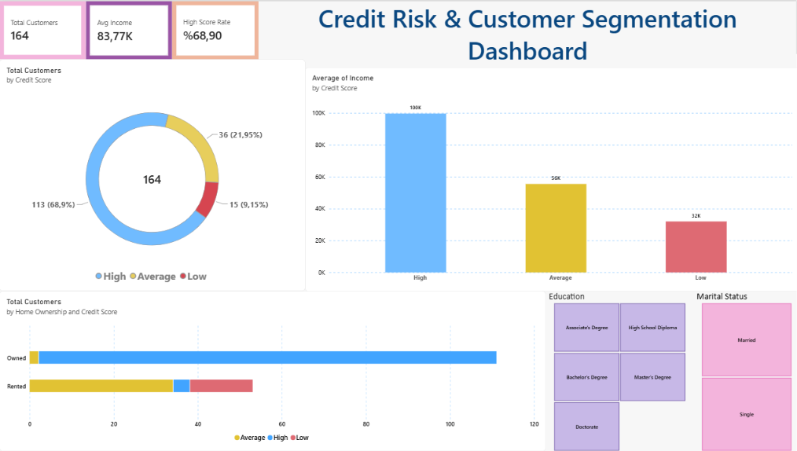

# 📊 Credit Risk & Customer Segmentation Dashboard (Power BI)

## 📌 Project Overview
This project delivers an interactive executive Business Intelligence (BI) dashboard built with **Power BI Desktop** to analyze customer risk profiles, creditworthiness, and demographic indicators. The goal is to provide risk management teams with actionable insights to optimize credit approval policies and segment portfolios effectively.

---

## 🖼️ Dashboard Preview


---

## 🎯 Key Business Questions Addressed
1. **Portfolio Quality:** What proportion of the loan customer base represents safe (`High`), moderate (`Average`), or defaulted/high-risk (`Low`) credit segments?
2. **Income vs. Creditworthiness:** How strongly does annual income predict customer credit scores?
3. **Collateral & Stability:** Does homeownership (`Owned` vs. `Rented`) act as a strong risk mitigation indicator?
4. **Demographic Risk Drivers:** How do education levels and marital status correlate with credit risk?

---

## 💡 Executive Insights & Analytical Findings
* **Income Segmentation:** 
  * Customers with **High** credit scores have an average income of **~$100K**, compared to **~$56K** for **Average** and **~$32K** for **Low** score customers. Income serves as a primary discriminator of credit health.
* **Home Ownership as a Risk Shield:** 
  * **98.2%** of homeowners (`Owned`) belong to the **High** credit score tier, with **0% default/low risk**.
  * Conversely, the **Low** credit risk segment is concentrated entirely within the **Rented** category (representing **28.3%** of all renters).
* **Marital & Education Stability:** 
  * Married applicants demonstrate an exceptionally low risk profile (**97.7% High score**).
  * Higher educational attainment strongly correlates with credit quality: **100% of Master's** and **96.8% of Doctorate** degree holders maintain high credit scores.

---

## 🛠️ Data Modeling & DAX Measures
Custom Data Analysis Expressions (DAX) were developed to ensure dynamic recalculation across all filters:

```dax
// 1. Total Customer Volume
Total Customers = COUNTROWS('Credit Score Classification Dataset (2)')

// 2. Portfolio Average Income
Avg Income = AVERAGE('Credit Score Classification Dataset (2)'[Income])

// 3. High Credit Score Ratio
High Score Rate = 
DIVIDE(
    CALCULATE(
        COUNTROWS('Credit Score Classification Dataset (2)'), 
        'Credit Score Classification Dataset (2)'[Credit Score] = "High"
    ),
    [Total Customers],
    0
)'''

📥 **[Download Power BI Dashboard (.pbix)](./Credit%20Risk%20&%20Customer%20Segmentation%20Dashboard.pbix)**
